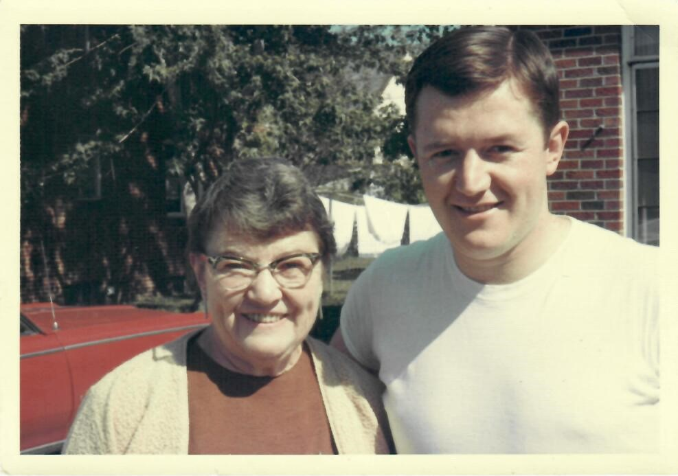
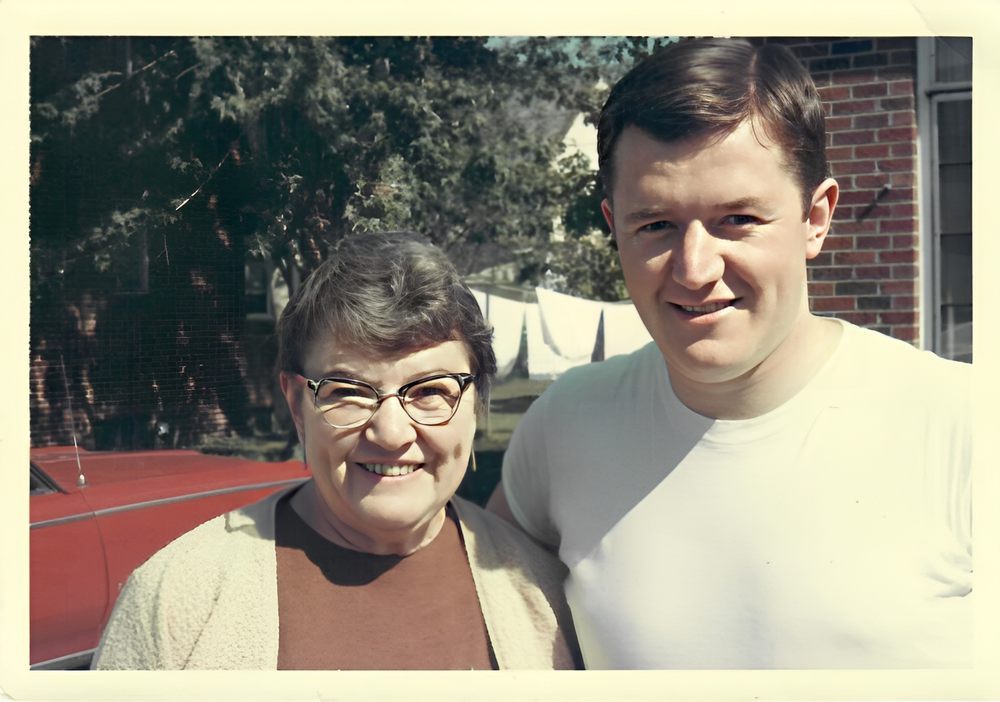

# Face Restoration with Generative Facial Prior

The original model was completed as part of the work by [Xintao Wang, Yu Li, Honglun Zhang and Ying Shan](https://arxiv.org/abs/2101.04061). You can see their full repo at [GFPGAN](https://github.com/TencentARC/GFPGAN).This repo is my container/Docker friendly version which conforms to my docker-compose set up you'll see across all my github projects. The original work requires PyTorch so I've pulled an optimized base image from Nvidia's container repo.
`nvcr.io/nvidia/pytorch:21.11-py3`

This build provides a containerized environment with all the requirements needed to run the GFPGAN model on NVIDIA GPUs.

|                       Original Image                       |                        Restored Image                        |
| :--------------------------------------------------------: | :----------------------------------------------------------: |
|  |  |

## BibTeX

    @InProceedings{wang2021gfpgan,
        author = {Xintao Wang and Yu Li and Honglun Zhang and Ying Shan},
        title = {Towards Real-World Blind Face Restoration with Generative Facial Prior},
        booktitle={The IEEE Conference on Computer Vision and Pattern Recognition (CVPR)},
        year = {2021}
    }
