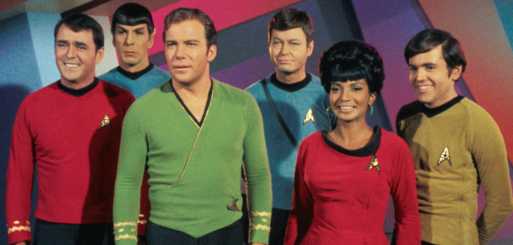

# Face Restoration with Generative Facial Prior

The original model architecture here was completed as part of the work by Xintao Wang, Yu Li, Honglun Zhang and Ying Shan. You can see their full repo at [GFPGAN](https://github.com/TencentARC/GFPGAN).

This repo is the deployment friendly which also conforms to my general docker-compose set up you'll see across all my github projects. 

The original work requires PyTorch so I've pulled an optimized base image from Nvidia's container. 
`nvcr.io/nvidia/pytorch:21.11-py3`

This provides a base conda environment with all the requirements for PyTorch and from this base env, I install the additional python packages required to run the model for inference. 

Original Image | Restored Image 
:-------------------------:|:-------------------------:
 | 

## BibTeX

    @InProceedings{wang2021gfpgan,
        author = {Xintao Wang and Yu Li and Honglun Zhang and Ying Shan},
        title = {Towards Real-World Blind Face Restoration with Generative Facial Prior},
        booktitle={The IEEE Conference on Computer Vision and Pattern Recognition (CVPR)},
        year = {2021}
    }